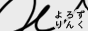

絵を描いたり何かを作ったり。\_φ(･\_･ 
記録程度に置いている意味のないサイトです。サイトは[Hugo](https://gohugo.io)で作成しています。

**SiteName：** HMLOG
**URL:** 
**Contact:** tsuwim@gmail.com

リンクフリー
 

内容のシェア・引用の際は出典元を明記すること

[🚩](backup) [🪑](desk) [👤](prof)

## Site Map

- [Home](/)  ...トップページ
- [About](/about)  ...このサイトについて
- [Memo](/memo)  ...雑感雑記
- [Works](/works)  ...制作したもの。絵やペーパーなど
- [etc](/etc)  ...色々置き場

---

## External Links

[世界史の窓](https://www.y-history.net/)
[今日のほしぞら(暦計算室)](https://eco.mtk.nao.ac.jp/cgi-bin/koyomi/skymap.cgi)
[Barbaroi!](http://web.kyoto-inet.or.jp/people/tiakio/)
[シンボルの源泉](https://www.typography.or.jp/symbol/)

<!-- Special Thanks
[Sunset and sunrise times API](https://sunrise-sunset.org/api) 日の出日の入り時間 API 
[星が好きな人のための新着情報](https://news.local-group.jp) 月齢計算 JavaScript -->

{style="text-align: start;"}

***

[ColBase: 国立文化財機構所蔵品統合検索システム](https://colbase.nich.go.jp/?locale=ja)
[国立国会図書館デジタルコレクション](https://dl.ndl.go.jp)

[口語訳聖書](https://pebutty.net/kougo/) [死者の書の呪文](https://en.wikipedia.org/wiki/List_of_Book_of_the_Dead_spells) [ギルガメシュ叙事詩](http://www.aurora.dti.ne.jp/~eggs/gil.htm) 
[ガリバー旅行記](https://www.aozora.gr.jp/cards/000912/files/4673_9768.html) [よだかの星](https://www.aozora.gr.jp/cards/000081/files/473_42318.html)
