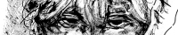

ネットの片隅に存在しているあんまり意味のないサイト。主な内容は制作物とブログ、その他メモや記録も目的としています。誤字脱字や真偽のほどはあんまり意味がないサイトなのであしからず。暇な時に更新します。

*There are many things in our society that have meaning to some people and no meaning to others.*

- サイト名： HMLOG (Himorogu)
- URL： 
- 管理人： 烏山 (Karasuyama)[プロフィール](prof) / [Neocities](https://mild.neocities.org)
- 連絡先： tsuwim@gmail.com / [Googleフォーム](https://docs.google.com/forms/d/e/1FAIpQLSdavy3JvDzFVRdmfFeDm0OMLWg5xf9_BZQgGFX5AHFX7hGWRg/viewform?usp=sf_link)
- リンクフリー
   
- 内容のシェア・引用の場合は出典元を明記すること

SNSなど
: [Threads](https://www.threads.com/@89__0531)…とっちらかっている
  [YouTube](https://www.youtube.com/@crowetcats)…始めたて
  [Google Drive](https://drive.google.com/drive/folders/1wx-GFKUohZp43SdItubYQijUvKrdc-nm?usp=share_link)…素材配布（共有フォルダ）



  
    
  
    
  
    

  
    

  
    

    

    
  
    



 

---

## Bookmarks
[世界史の窓](https://www.y-history.net/) [国・地域(外務省)](https://www.mofa.go.jp/mofaj/area/index.html) [今日のほしぞら(暦計算室)](https://eco.mtk.nao.ac.jp/cgi-bin/koyomi/skymap.cgi) [車田正美オフィシャルサイト 生々流転](https://kurumadapro.com/) [Barbaroi!](http://web.kyoto-inet.or.jp/people/tiakio/) [アニメに感謝 星まことの探求ブログ](http://animenikansya.blog.fc2.com) [シンボルの源泉](https://www.typography.or.jp/symbol/) [ColBase: 国立文化財機構所蔵品統合検索システム](https://colbase.nich.go.jp/?locale=ja)

[青空文庫](https://www.aozora.gr.jp) [口語訳聖書](https://pebutty.net/kougo/) [死者の書の呪文](https://en.wikipedia.org/wiki/List_of_Book_of_the_Dead_spells) [ギルガメシュ叙事詩](http://www.aurora.dti.ne.jp/~eggs/gil.htm)

 

### Special Thanks
[Sunset and sunrise times API](https://sunrise-sunset.org/api) 日の出日の入り時間 API
[星が好きな人のための新着情報](https://news.local-group.jp) 月齢計算 JavaScript
[GL-ノバンチカ源](https://github.com/Gutenberg-Labo/GL-NovantiquaMinamoto) 漫画セリフ用アンチゴチ
[Takehiro Tezuka](https://takehirotezuka.com) いちばん近くのアーティスト

..........................................

Flashエミュレーター(Chrome拡張あり) [Ruffle](https://ruffle.rs/)

 『Sourire』
https://www.arakishingo.com/pc/pieces/sourire/vol01/ https://www.arakishingo.com/pc/pieces/sourire/vol02/ https://www.arakishingo.com/pc/pieces/sourire/vol03/ https://www.arakishingo.com/pc/pieces/sourire/vol04/

> 
> こっそり書いてきたまんがも人に知られてしまったが　いねむりの時に<ruby>度々<rt>たびたび</rt></ruby>みるふしぎな夢の話はまだ誰にも話してなかった。いつかまんがのストーリーづくりに役立つと思って....