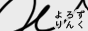
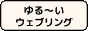

[世界史の窓](https://www.y-history.net/) 
[国・地域(外務省)](https://www.mofa.go.jp/mofaj/area/index.html) 
[今日のほしぞら(暦計算室)](https://eco.mtk.nao.ac.jp/cgi-bin/koyomi/skymap.cgi) 
[Barbaroi!](http://web.kyoto-inet.or.jp/people/tiakio/)
[アニメに感謝 星まことの探求ブログ](http://animenikansya.blog.fc2.com)
[シンボルの源泉](https://www.typography.or.jp/symbol/)
[ColBase: 国立文化財機構所蔵品統合検索システム](https://colbase.nich.go.jp/?locale=ja)
[Google Arts & Culture](https://artsandculture.google.com/u/1/)
[国立国会図書館デジタルコレクション](https://dl.ndl.go.jp)

{style="text-align: start;"}

<!-- ### Special Thanks
[Sunset and sunrise times API](https://sunrise-sunset.org/api) 日の出日の入り時間 API
[星が好きな人のための新着情報](https://news.local-group.jp) 月齢計算 JavaScript -->

<!-- ---
[口語訳聖書](https://pebutty.net/kougo/)
[死者の書の呪文](https://en.wikipedia.org/wiki/List_of_Book_of_the_Dead_spells)
[ギルガメシュ叙事詩](http://www.aurora.dti.ne.jp/~eggs/gil.htm) -->

