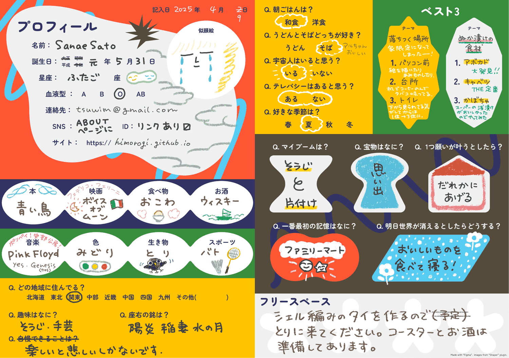

*he〜 he~*　[鵺の泣き声](https://youtu.be/ECY-h89ihTg?si=TPGLV51JWMOcmkZ_)　

***

1989年　東京都荒川区生まれ
2008年　越谷北高等学校普通科文系 卒業
2014年　多摩美術大学グラフィックデザイン学科 卒業

小さな頃は夜驚症で泣き止むまで母に抱かれながら月眺めていたことをよく覚えている。アリス症候群は今も時々感じる。小さくなったり大きくなったり。

---

### 読みたい本リスト

- 騎士団長殺し
- 夜間飛行

### 欲しいものリスト
- Hikari Saint Seiya- Araki Shingo artbook
- 世界シンボル大事典 大修館書店
- (神々の熱き戦いのVHS)

[Amazonリスト](https://www.amazon.jp/hz/wishlist/ls/YFOWBL26M5ED?ref_=wl_share)

