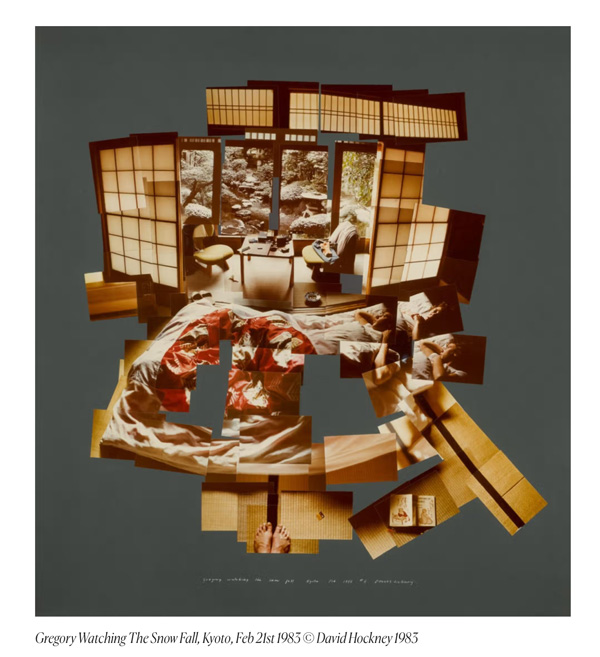

*写真技術は1830年代末に同時多発的に発生した。*

4 BC
: 古代ギリシア　アリストテレス（物理学の祖）
  : 鏡の反射、気象、色彩等の現象の観察から光についての考察がされた。
    ※日食時の木漏れ日が丸くなることの記述→のちのピンホールカメラの原理につながる。

AC 11
: 『光学の書』アラビアの学者　イブン・アル＝ハイサム　
  : レンズの観測（焦点、像の拡大、像の倒立、屈折率など）

AC 13
: フランチェスコ会士　ロジャー・ベーコン
  : 鏡やレンズを使った装置による光の観察・報告
    小穴投影現象を活用した日食観測装置の考案
: イタリアルネサンス絵画
  : ドゥツチオ、ジォットら　遠近法初期
    ↓
  AC15–16の間に「カメラ・オブスクラ」の発生・使用がある。
  AC 15：ブルネレスキ、アルベルティ
  AC 16：ダ・ヴィンチ

AC 16
: 1558年『自然魔術』ナポリの学者　ジョバンニ・バティスタ・デッラ・ポルタ
  ※カメラオブスクラの紹介**記述**からカメラ・オブスクラが広く流布し改良がなされる。装置の穴の部分にレンズを取り付け像を鮮明なものへ。

AC 17
: 1646年『光と影の大いなる術』イエズス会士　アタナシウス・キルヒャー
  : カメラ・オブスクラの**図解**（移動式タイプ）
  : >
: レフレックス型　カメラ・オブスクラ
  : より小型でレンズからの光を鏡に反射させスクリーンに映し出す仕組み
: 視覚に関するテクノロジーの発達から、カメラ・オブスクラが科学や芸術で活用される。
  : ロバート・ボイル：「元素」概念の確立と発展
  : 1725年　ヨハン・ハインリッヒ・シェルツェ
    : 塩化銀が光の作用で黒変することを発見
      ↓
      ハロゲン化銀の観光性の研究
      光による物質への作用の定着、保持の研究
: ブルジョワ社会
  : 肖像画の世俗化と拡大（自分や家族の肖像を持つ習慣が19Cまでに浸透する）
  : シルエットや<abbr text="小さな油彩画">ミニアチュール</abbr>という肖像画の新形態
  : タゲレオタイプ：1839年フランスのタゲールが考案。肖像写真に用いられた
  
AC 19
: 1826年 ニエプス『ル・グラの窓からの眺め』
  : カメラ・オブスクラを使用した最古の現存する写真
  : >
: 1840年代初頭
  : パリ、ロンドン、NY、ベルリン、ハンブルクに最初の肖像写真スタジオが開設され、のちに地方都市へも波及する。
  : 長時間露光のため数秒から数十秒の間被写体の人物は動けない→堅く儀式的な写真
: 1850年代中ごろ
  : タゲレオタイプ：カロタイプの発展系。ガラス湿板の技術
: 1851年　「ミッション・エリオグラフィック」フランスのによる記録事業
  : ブランカール＝エヴラールが設立。写真と出版の結びつきによる新たな産業（以前は版画と印刷）。
: 1850〜80年年代
  : 「アンブロタイプ」「ティンタイプ」複製できないが簡便かつ安価
  : 「コロジオン」（湿板法）「アルビュメン法」（卵白を使用）複製可能かつ紙焼き
  : ナダール、カルジャ（<abbr text="事物を簡略化し誇張したり滑稽化して描いた絵">カリカチュア</abbr>画家から写真家へ転向）自然でデッサンのような肖像写真
: 1854年
  : 特許「カルト・ド・ヴィジット」（名刺判写真）
    : 8~12カットの連続写真
    : 1860年代をピークに流行（安価）→広い層に普及
: 1856年〜
  : ルイス・キャロル（少女写真）
    : >
  : ジュリア・マーガレット・キャメロン（近親者のポートレート）
: 1857年　『人生の二つの道』レイランダー　**合成写真**、ルネサンス絵画的、寓意的、演出的
  : >
  : 参考：[Revised Edition “オスカー・ギュスタヴ・レイランダーの挑発” by 甲斐義明 | documents | photographers’ gallery](https://pg-web.net/documents/revised-edition-050901/)
: 1869年『写真における絵画的効果』ヘンリー・ピーチ・ロビンソン
  : 人工的な合成を勧める。絵的に美しいものを目指した写真
: 1855年頃 ピクトリアリズム
: 1889年『自然主義写真術』ピータ・ヘンリー・エマーソン
  : 寓意的合成、宗教や神話性を否定し、自然から受ける視覚的印象をより率直に写真にする
↓大きな影響
: 1892年　リンクト・リング・ブラザーフッドのメンバー（イギリス）
: 1910年頃　アルフレド・スティーグリッツ（アメリカ）ストーレトフォトグラフィ

*** 

あとはほとんど美術の歴史と同じです。

以下は写真に関連する個人的に気になっているアーティスト、作品
- シンディ・シャーマン（コンセプチュアル・セルフポートレイト）
  - [シンディ・シャーマン — Google Arts & Culture](https://g.co/arts/ykFYNJLti8X9A48Z8)
- ローズ・セラヴィ
  - [彼女の独身者たちによって裸にされた花嫁、さえも](https://en.wikipedia.org/wiki/File:Duchamp_LargeGlass.jpg#/media/File:Duchamp_LargeGlass.jpg)
  - [（1）落下する水、（2）照明用ガス、が与えられたとせよ](https://en.wikipedia.org/wiki/File:Etant_donnes.jpg#/media/File:Etant_donnes.jpg)
- デイビット・ホックニー 
  >
---

{}
{}

参考資料
: 『世界写真史』飯沢耕太郎，美術出版社
: 『[主な技法解説](https://topmuseum.jp/upload/3/3453/gihoukaisetu.pdf)』東京都写真美術館
: Wikipedia