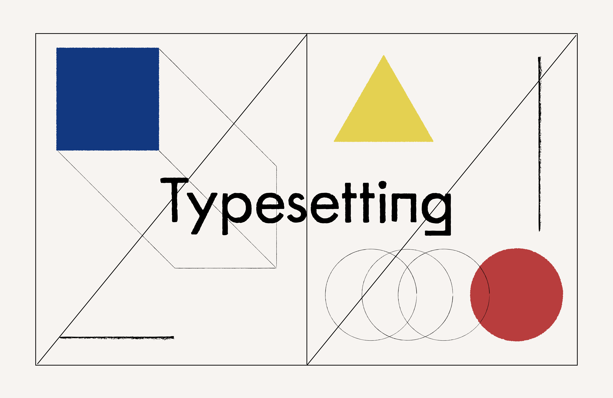

## レイアウト

- [Canons of page construction - Wikipedia](https://en.wikipedia.org/wiki/Canons_of_page_construction) 中世の写本などに用いられたページレイアウトの種類

## 文字

- [Scribal abbreviation - Wikipedia](https://en.wikipedia.org/wiki/Scribal_abbreviation) 
- [Thorn (letter) - Wikipedia](https://en.m.wikipedia.org/wiki/Thorn_(letter)) 
- [Monogram - Wikipedia](https://en.m.wikipedia.org/wiki/Monogram) 
- [グーテンベルク42行聖書 | 慶應義塾大学メディアセンター デジタルコレクション Digital Collections of Keio University Libraries](https://dcollections.lib.keio.ac.jp/ja/gutenberg)

[Ichthys](https://en.wikipedia.org/wiki/Ichthys)

