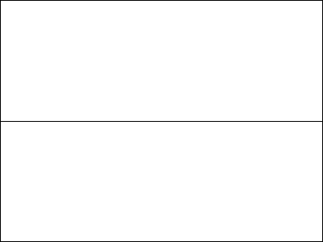
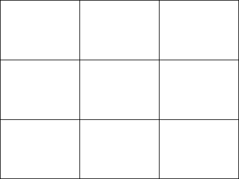
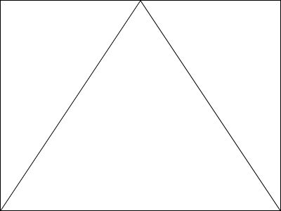
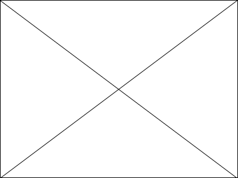
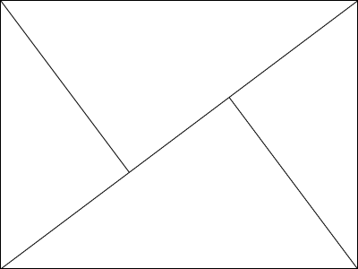
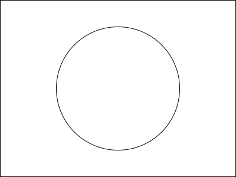

## 貴金属比
|  |  | | | 
| --- | --- | --- | --- |
| 黄金比 | Golden ratio | 1 : 1.618 | 

 |
| 白銀比 | Silver ratio | 1 : 2.414 (1 : √2)| 

 |
| 青銅比 | Bronze ratio | 1 : 3.303 | 

 |
| 白金比 | platinum ratio | 1 : 1.732 | 

 |


  .ratio-box{
    border: var(--border);
    max-height: 3em;
    background-size: 9px 9px;
    background-image: repeating-linear-gradient(-45deg, #9f9f9f 0, #9f9f9f 0.9px, #ffffff 0, #ffffff 50%);
  }


## 数列
|  |  |
| --- | --- |
| 等差数列 | 1 2 3 4 5 6| 
| 等比数列 | 1 2 4 8 16 32|
| フィボナッチ数列 | 1 1 2 3 5 8 13 21| 


  pre{
    border: none;
padding: 0;
overflow: hidden;
  }


## 分割法・構図
|  |  | |
| :-: | :-: | :-: |
|二分割 |三分割  |三角構図  |
|対角線 |黄金分割  |日の丸  |
{style="table-layout: fixed;"}
