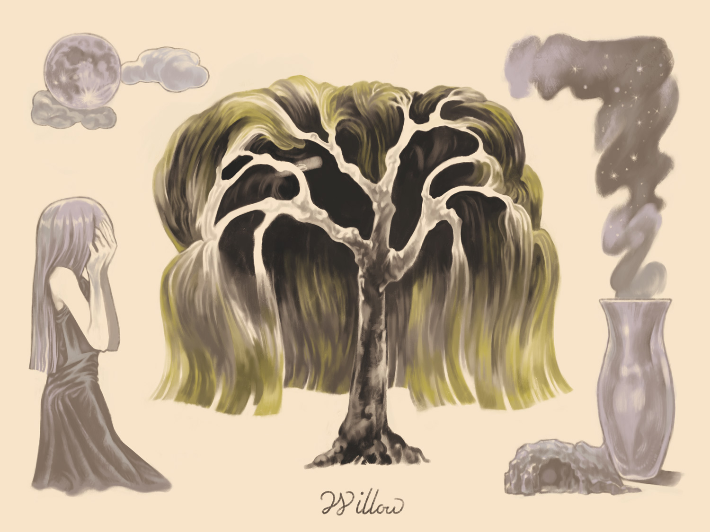

## ヤナギ

>それからというもの姉は、毎日、川の辺にきてはたたずんで、じっと水の面に映うつる自分の姿を見てはものを思い、（中略）ある日のこと、姉は日が暮れても帰らずに一ところに立ちつくしていますと、一夜の中に姉の姿は消えて、そこに一本の柳となっていたのであります。
>〈木と鳥になった姉妹 小川未明〉

- 死・冥府・貞潔
- 月・水
- ヘカテー/オルフェウス/柳女/三十三間堂の棟木

1700年の終わりから1800年の初めにかけて、ピューリタンの墓石には壺またはランプとヤナギが彫刻された。
ハープ（ハイランドハープを含む）はしばしば柳から彫られた。
日本の民話に柳の精や妖怪があり、変身談として語られる。
