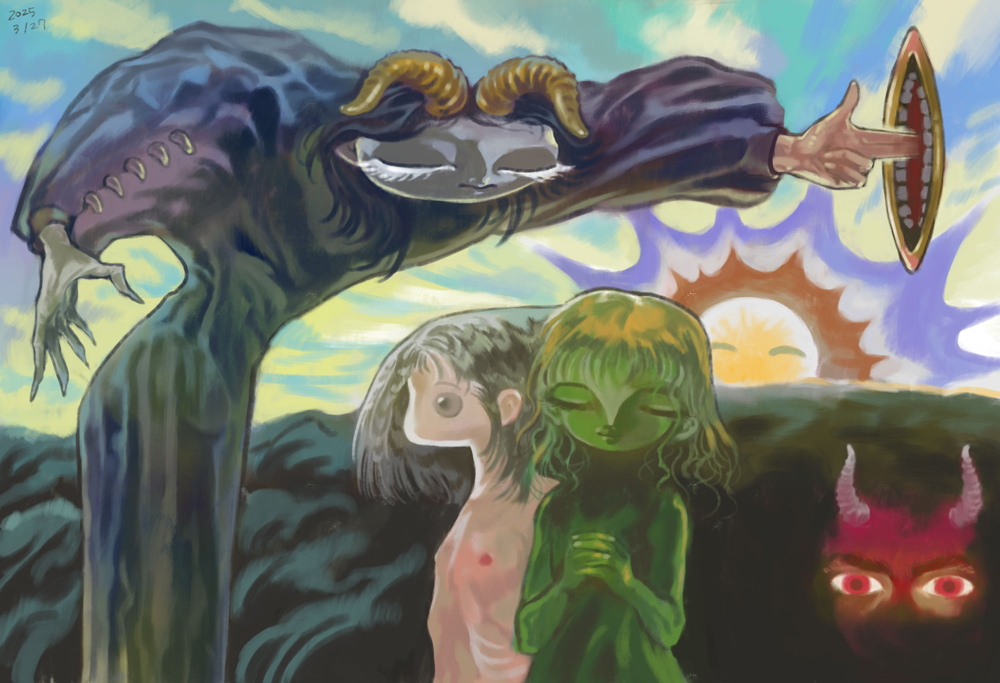
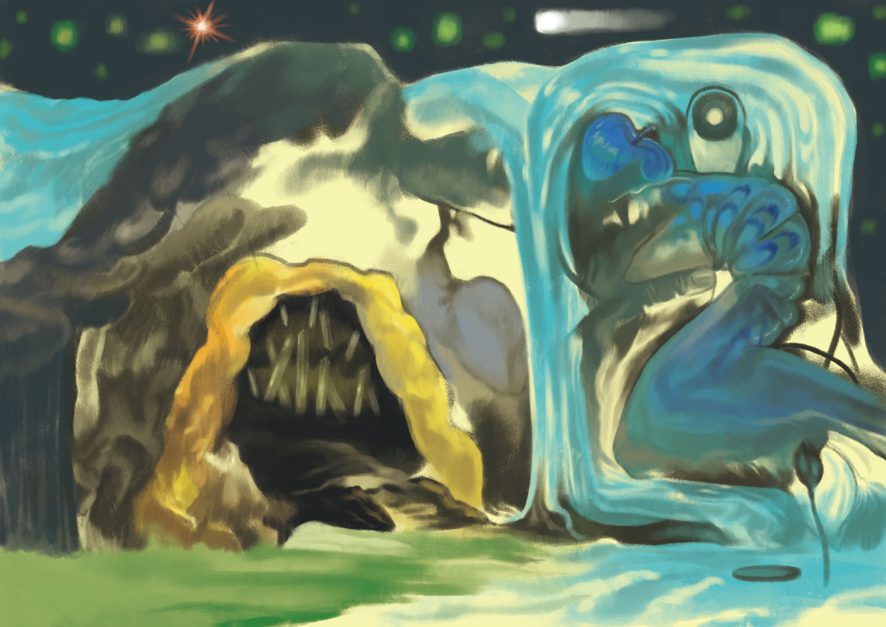
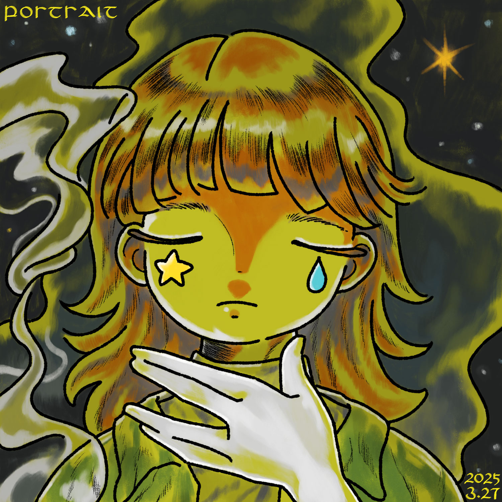

 

*太陽の翳 / 美しいものが引きつける強い力*
参考：[The Great Red Dragon and the Beast from the Sea ](https://artsandculture.google.com/asset/the-great-red-dragon-and-the-beast-from-the-sea-0000/NgGp3PH5_BqlDg)(ウィリアム・ブレイク)

 

*天使の結婚*
>そのころ、またその後にも、地にネピリムがいた。これは神の子たちが人の娘たちのところにはいって、娘たちに産ませたものである。彼らは昔の勇士であり、有名な人々であった。
>〈口語訳旧約聖書〉6:4　[口語訳聖書 - 創世記](https://pebutty.net/kougo/genesis.html)

 

# 「虹の彼方に」または「家族の肖像」

これから、ある夏子について書き残す。
あの時とこの時、今と過去、とにかく彼女は<u>同時に存在していた</u>。時間とは有限ではなく隙間なく置かれた箱のようにどこまでも連なっている/重なっている。夢も現実であり現実が夢なのだ。

---

##  Side A 
　　　*あなたの手は汚れている*

ここは多摩境にある三つ目山公園だ。ゲイサイ、芸祭の途中で夏子と僕はサークル棟を抜け出し公園のベンチで話をしていた。失ってしまったあの子について。
10月28日に僕らは初めて交わった。月の光が差し込む彼女のアパートのベッドの上で。

夏子は写真が好きだった。いつも大学の写真センターにある暗室でフィルムを印画し時々外の喫煙所で煙草を吸う。カーテン、赤いライト、水の音、酢酸の匂い、二匹の魚。暗室に入ったことのない僕にそんな話をしてくれた。「暗がりで像が浮かび上がるの。」彼女はそんなふうに言う。

　　　*現像、停止、定着。現像、停止、定着。現像、停止、定着………*

音楽は好きだ。プログレもジャズもクラシックも。その頃失ったあの子のためにパフォーマンスを初めた。ただの思いつきだろうけれど今も続けている。
紙飛行機、男女、海、ろうそく、内臓、花、そしてギフト。それが僕の絵画のモチーフでありパフォーマンスの源泉だった。

***

ただ楽しかった。彼女との生活も性交も彼女の作品も愛していた。

---

## Side A’
　　　*君に触れたい*

上京しアルバイトをしながら生活していた。絵は好きだ。ニコラ・ド・スタール、クロード・モネ、フィンセント・ファン・ゴッホ、エゴン・シーレ。大抵は近代画家で現代アートはあまり好まない。

夏子の元カレは美大を卒業後、画家として生計を立てているらしい。夏子は今もあいつが好きなのだろう。だから性交のたび僕は彼女に尋ねる。「愛してる？」と尋ねる。決まって彼女は困った顔をする。やはりあいつが好きなのだ。
あいつの展示を見たら自分より上手かった。悔しかった。自分の絵は趣味の延長でしかない。油彩なんか描けるわけがない。帰って夏子にあたった。何度も何度も。

夏子とは同居を初めてすぐに結婚した。最初のアパートは追い出された。夏子が隣の父親に色目を使ったからだ。二つ目のアパートは長く住んだ。

きっかけは夏子が犯されたことだ。梯子点検の時、作業服の男にシンクの前で。獣みたいな性交だ。それを夏子から聞いて俺は何もしなかった。管理会社への連絡も警察への相談も。
その頃は生活も限界だった。二人でアルバイトをしても残るのは数千円。悪いこともした。詐欺、窃盗、そして…。そんな生活に嫌気がさしていた。夏子はもっと辛かったのだろう。

夏子はある時から寝たきりになった。そんな夏子に何度も尋ねた。「仕事は？」「仕事は？」「お前が働かないと」

***

そうだ、夏の日だ。8月の日差しが眩しい日だった。俺は夏子の首に紐をかけてやった。彼女は笑った。気持ちが良かった。
台所から見えるすりガラスの向こうに白い影が掛かっている。それを見ながら何日も考えた。
最後に欲しがっていた麦わら帽子、買えなかった麦わら帽子。

「こんな世界なんて消えてしまえ！」叫んだ。ただの換気扇に向かって。
地震があった。マグニチュード9.0。津波、放射能。俺はアパートで一人地響きを聞いていた。

***

　　　*ぼくの心にふる雨はそれからやむことがない……*

台所の机で聴いた最後のことば。誰かこの雨をとめてくれ。

 

# 仮面のこころ
{class=title}

Title
: 

Year
: 2025

Software
: Photoshop

Reference
: 鵺
