## ＊ZODIAC＊
{.title}

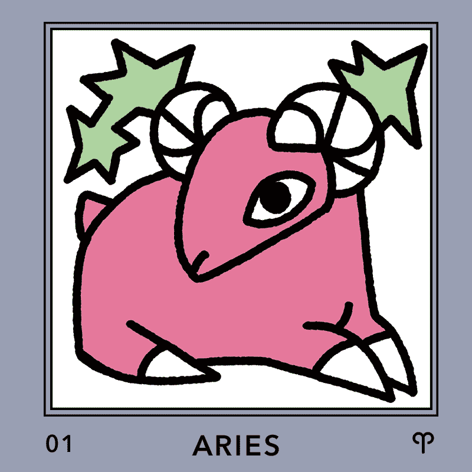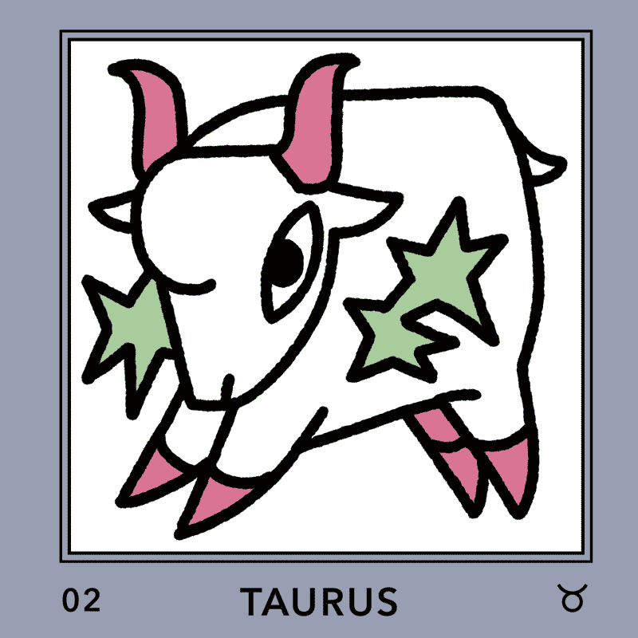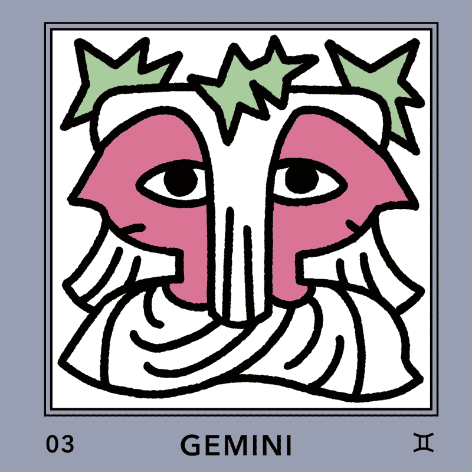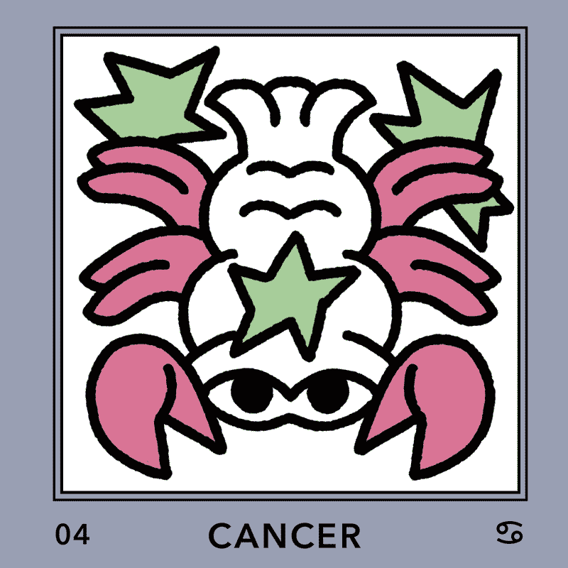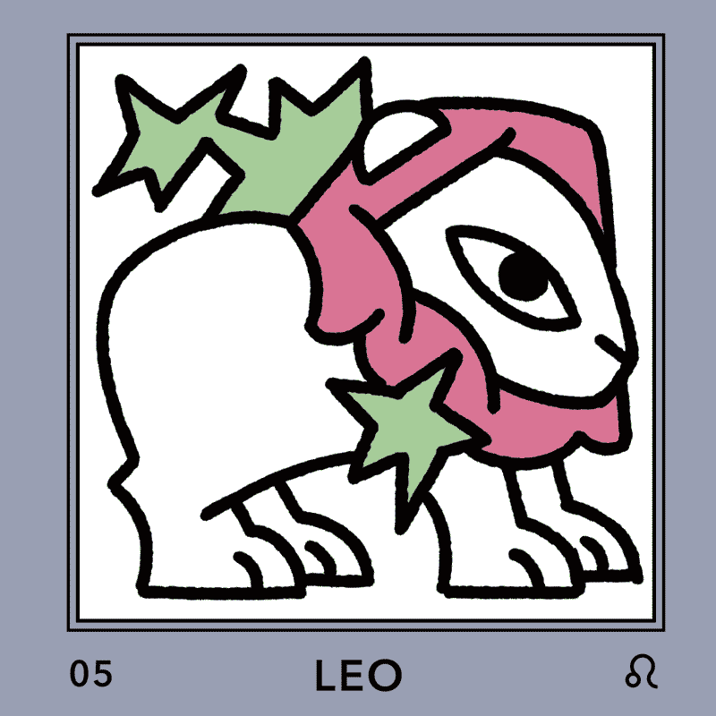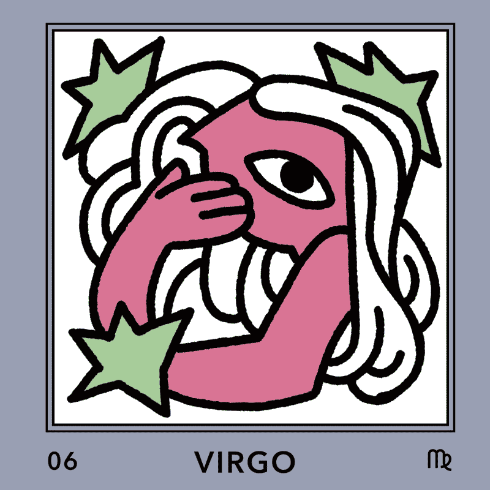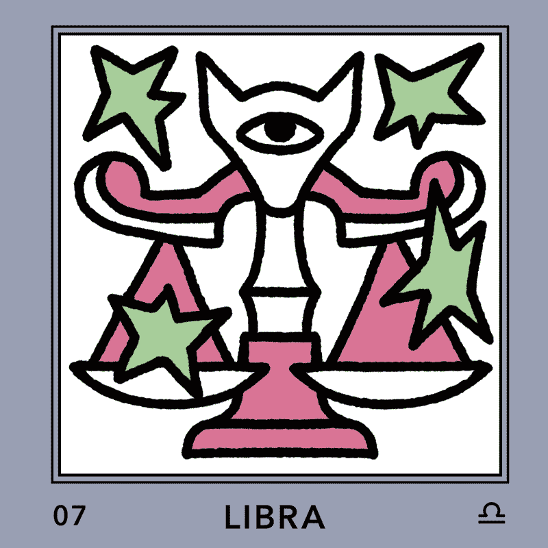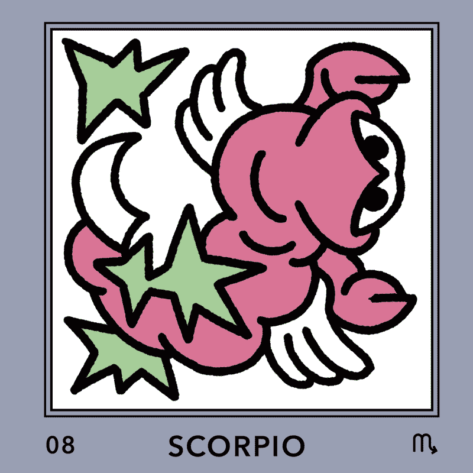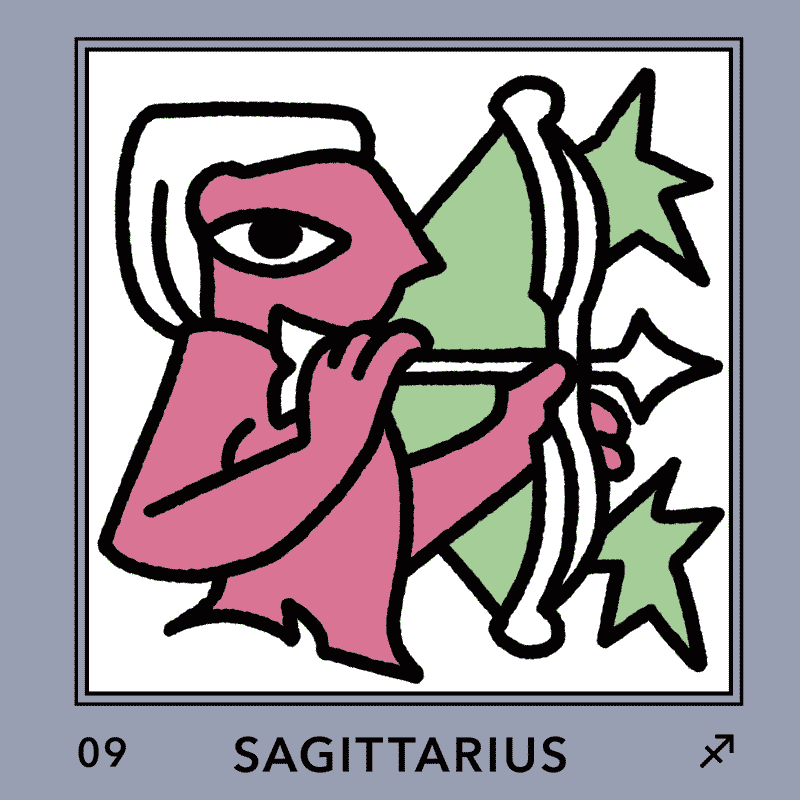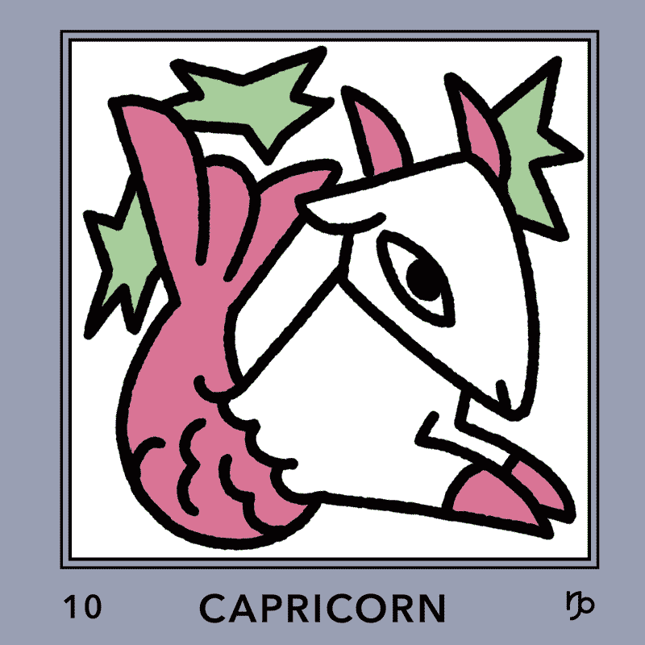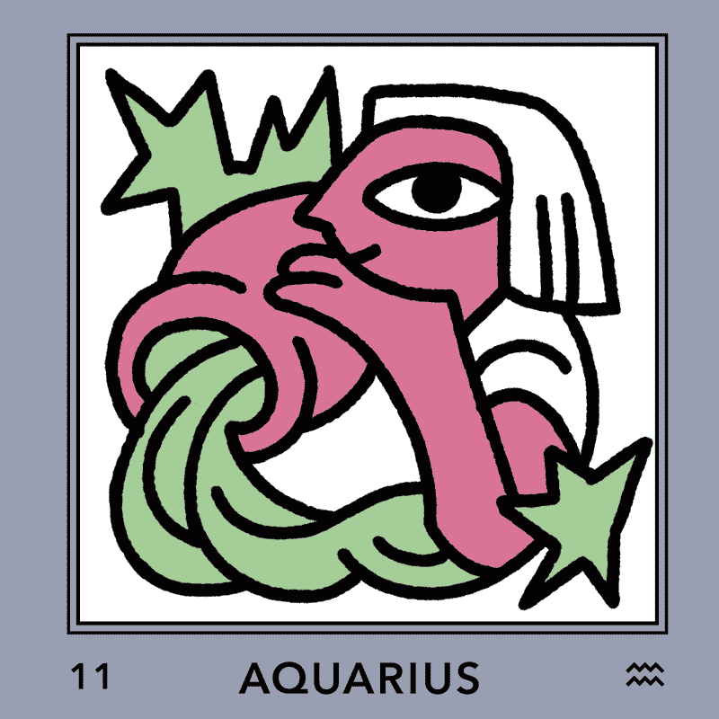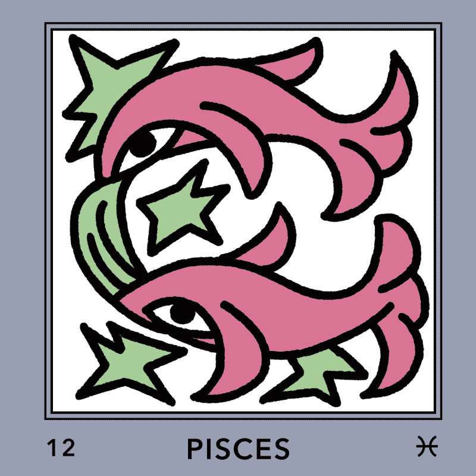

  

## ＊PLANETS＊
{.title}

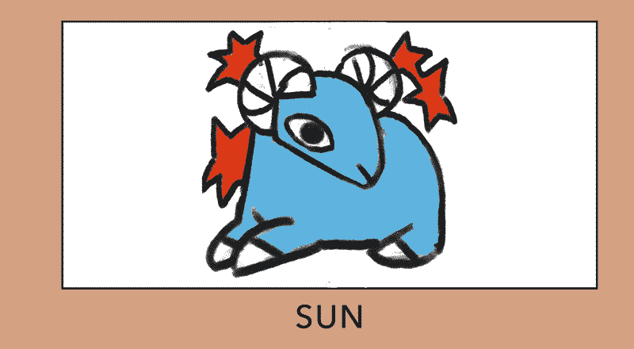



#zodiac,#planet{
    display: flex;
    flex-wrap: wrap;
    gap: 1rem;
    justify-content: center;

    figure{
    margin: 0;
    width: 100%;
   box-shadow: 0 4px 8px -2px rgba(0, 0, 0, 0.2);
   line-height:0;

    img{
            border-radius: .3rem;
    }
}
}
#zodiac > figure{
        max-width: max(calc(25% - 1rem), 9rem);
}

#planet > figure{
        max-width: max(calc(50% - 1rem), 18rem);
}


  

## ＊SKETCHES＊
{.title}

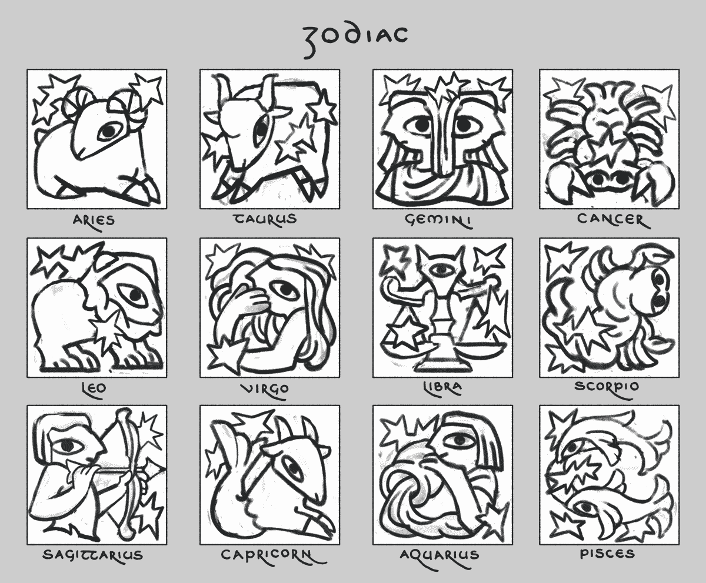

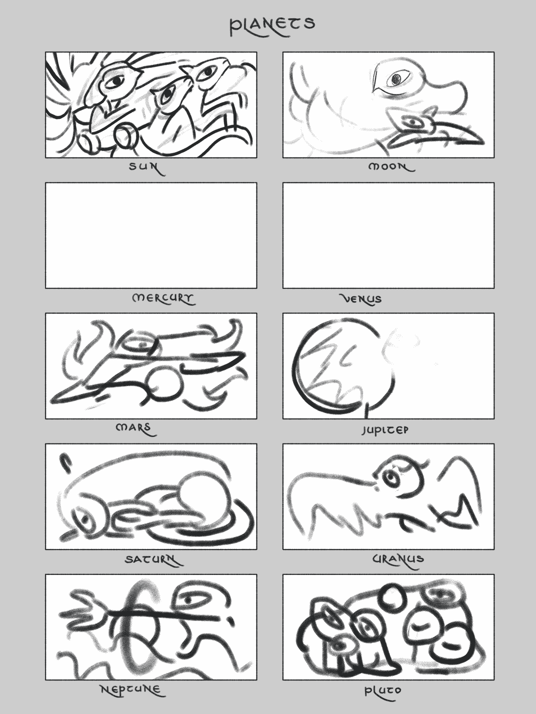

Title
: 　

Year
: 2025

Software
: Photoshop
