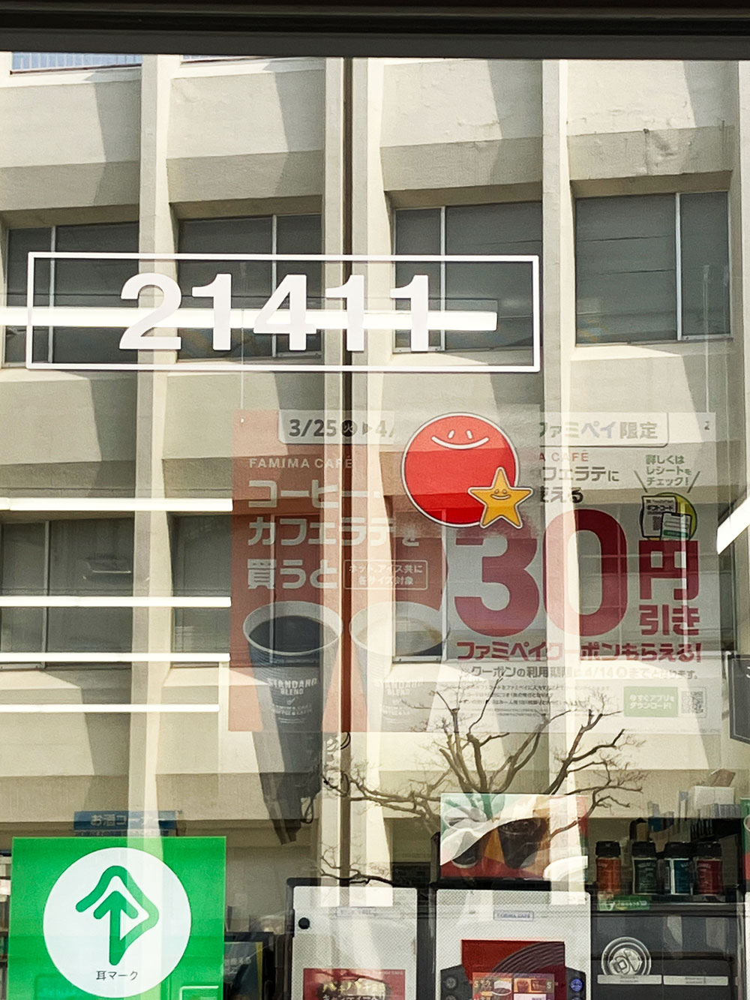
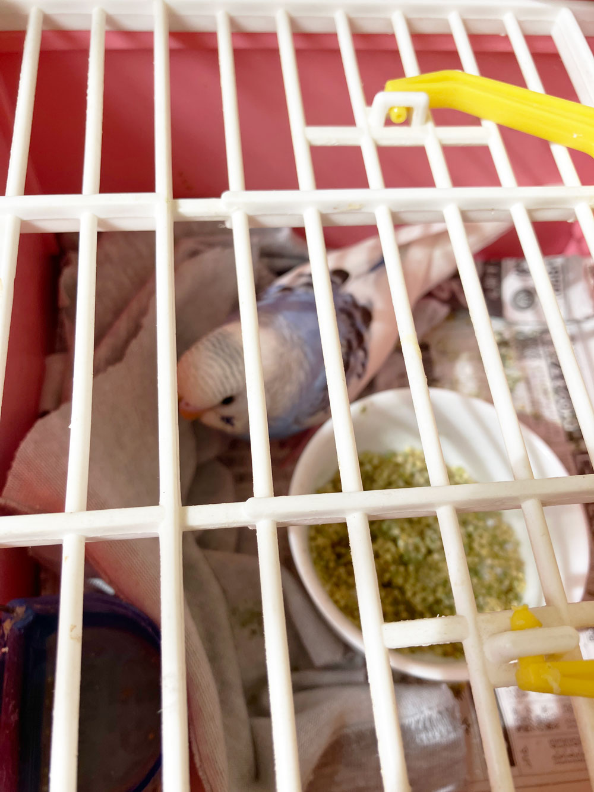
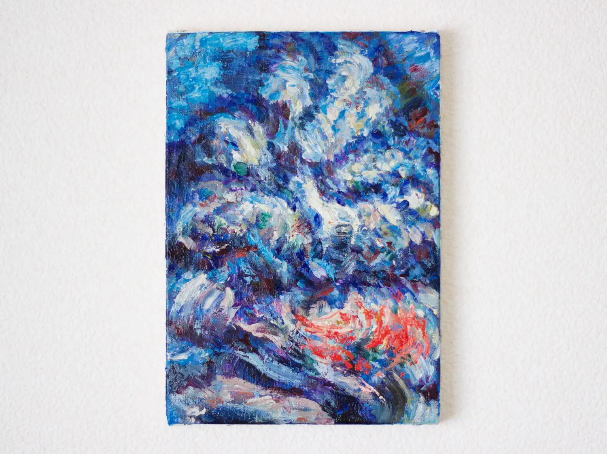

西口のファミリーマートがリニューアルオープンしていたので遊びに行った。
入り口近くに昔のファミマのマークを発見して懐かしいやら嬉しいやら。私の一番最初の記憶は草加市の田んぼのあぜ道と剥き出しの用水路だと思っていてのだけれど、そういえばその前に荒川区熊野前近くのマンションに住んでいたことを思い出した（0〜3歳の頃）。その頃にファミリーマートの太陽と星の白い看板をベランダから見ていた記憶がある。あとは母親におんぶされて暗い階段を登ったことも。ファミリーマートは日中の本当にただ白い情景の記憶でなんだか夢で見ただけのような気もしてしまうけれど。

最近は多くの物事を思い出している。今日はこんな日記を書いていて、彷徨っていた朝方に駅前で会ったスーツが似合うおじ様とミケランジェロのピエタの話しをしたことを思い出しました。ほんの数ヶ月前なのになんだか懐かしい気分です。

セキセイインコのしーちゃんは今日も元気です。あっと言う間にひとり餌もできるようになって（見ている時の方がよく食べるけれど）、飛ぶ練習も順調に。今朝は服の中で練習始めてくすぐったかった。
名前はShe/Seaが由来なのだけれど、男の子だったらいつもの法則でしー太になるに違いない。ラピュタみたいだ（ジブリの方）。

***

あなたに云いたいこともたくさんあった。これは本当に霊感なのかもしれないけれど。
夢の中で流れた男の子のことを見た。道具は嫌と云う女の子。踏切で　　　しまった(私の)友達のことも。11月下旬に気付いて泣きました。星が綺麗な夜でした。
楽しい夢も見ています。脚立で料理する夢、庭を耕す夢、電話番をする夢。
2021年の夏に私は一度死にました。空気を入れてくれたことは覚えています。名前を呼んだことも。
私にとってはそれが誰であってもよかったのです。

<iframe style="border-radius:12px" src="https://open.spotify.com/embed/track/7bRzEREqfcU6XArkgWCMYs?utm_source=generator" width="100%" height="352" frameBorder="0" allowfullscreen="" allow="autoplay; clipboard-write; encrypted-media; fullscreen; picture-in-picture" loading="lazy"></iframe>

***

*斗いの記録*

