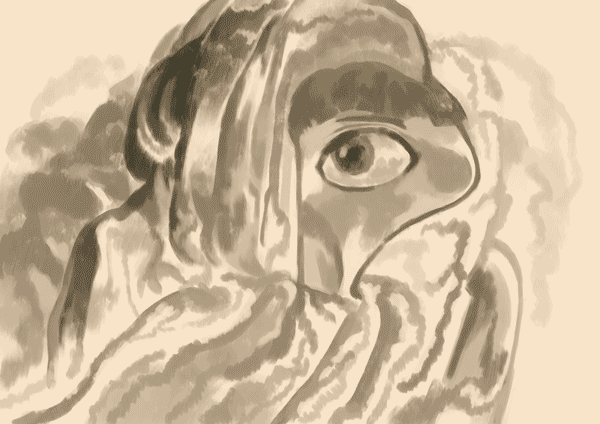
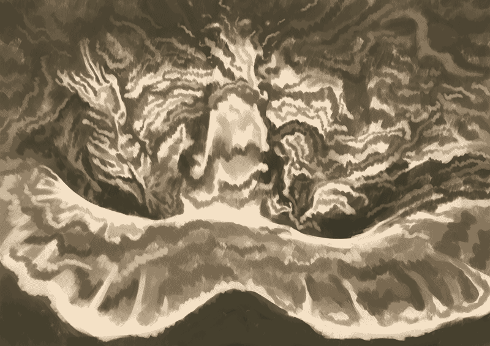
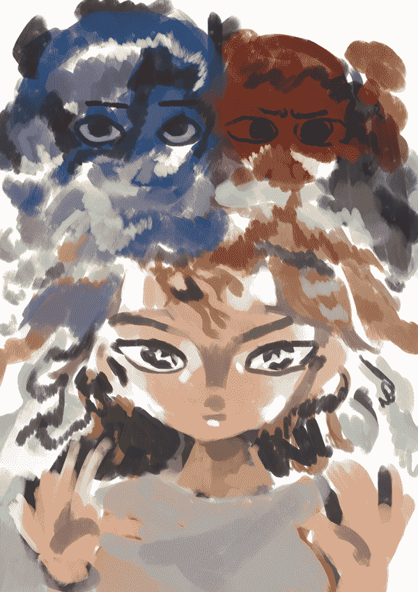
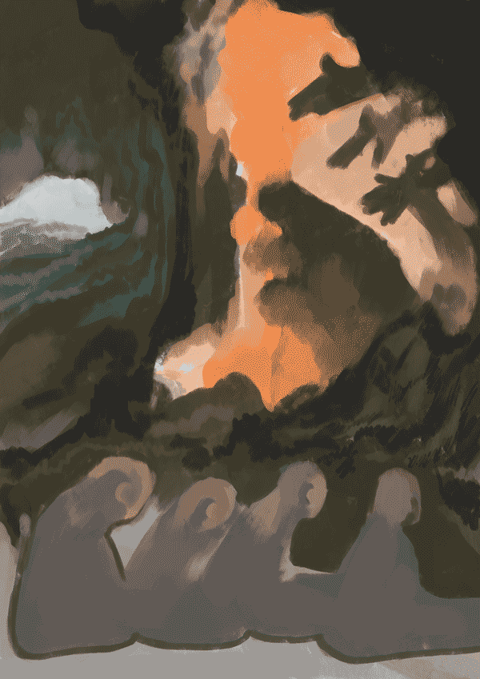

 

この暑さで紫陽花が咲いている不思議。今年はなにかおかしい陽気。

***

メモ

6/17 わたしが自分のために作る物語というのは数年前に終わってしまっていて、じゃあなんで今作るのかと言ったらそうせざるを得ない・必要だからなのだろう。制作にアイデンティティを見出しているわけでもないから何らかの原動力や社会的評価も離れたところにあってただ淡々と進んでいる。がらんどうが正しいのかは判らないけれど今のところ収まるべきところに収まっている感覚はある。
暑さが心地良くなってきた。そういや誰も見ていなくてもネットに書く意味があるらしいっすよ。今日は旦那と地続きのような夢を見て夢の話をした。黒曜石が密集した炭鉱のような出口がないドーナツ状の地下道を回り続ける白目のない女。近づくな〜と言ったらしい。気づいたらそこにいて気付いたら外にいた。そんな夢。
6/16 習慣に裏付けられた社会性人格の終焉 / 思い込まされていてどうでもいいこと。
ユング的精神分析に則れば集合体としてのanimusが嫉妬狂いと無いものねだりの無気力で病気らしいっすよ。どうでもいいが、芸術とか文化的要素は1900年代のやり直しするんじゃないかな。アメリカ的な資本主義芸術が主体だったなんて後年の人たちに批判されそうだもの。追記：ハイカルチャーのこと。今はローカルチャーに媚びてる印象。
6/15 山勘：ラップ(パ)・玉・ショートヘア 
6/14 夜：温度（2024年春再び・今回高熱）