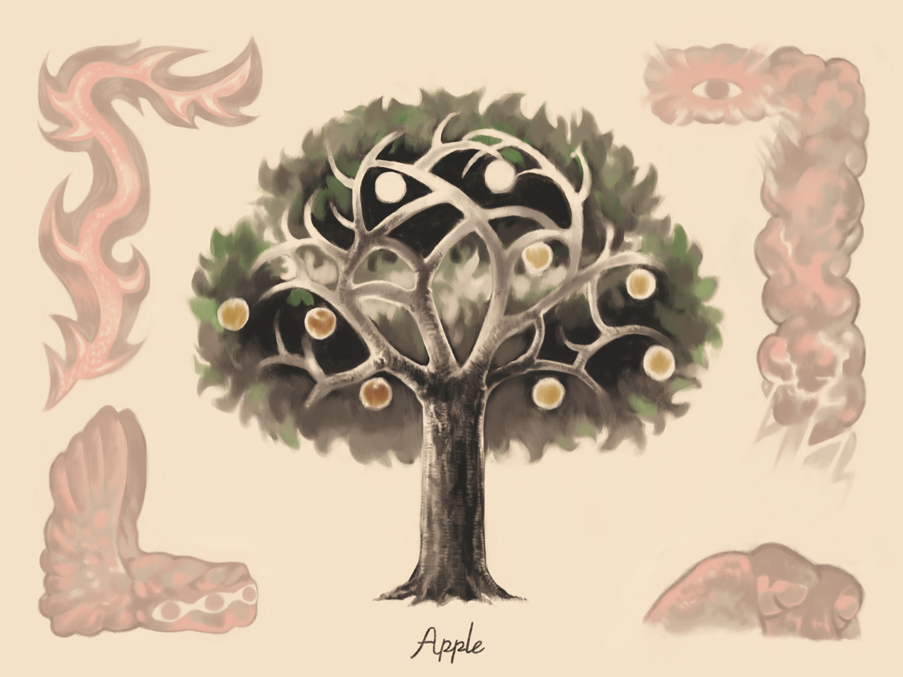

## リンゴ　

>主なる神はその人に命じて言われた、「あなたは園のどの木からでも心のままに取って食べてよろしい。
>しかし善悪を知る木からは取って食べてはならない。それを取って食べると、きっと死ぬであろう」。
> 〈口語旧約聖書 2:16–2:17〉

- *豊饒・欲望・悪・不和・支配*
- 黄金のりんご/知恵の木/生命の木

ギリシャ神話では黄金（不和）のリンゴをめぐって美しさを競うエリスとアテナの物語がある。