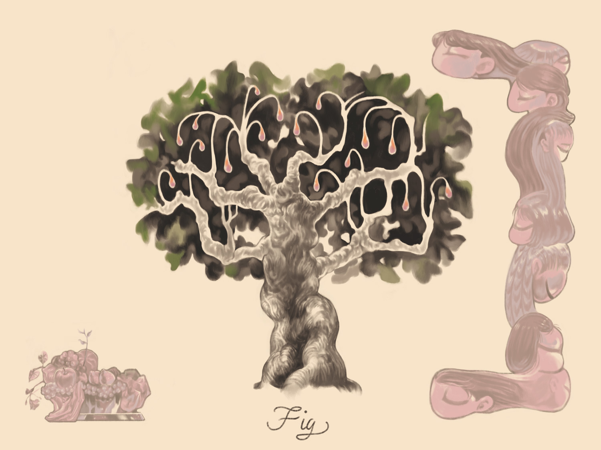
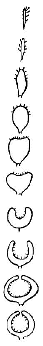

## イチジク

>夏の午前よ、いちじくの葉よ、
葉は、乾いてゐる、ねむげな色をして
風が吹くと揺れてゐる、
よわい枝をもつてゐる……
> 〈いちじくの葉 中原中也〉
- 喜び・罪・堕落・豊穣
- ディオニュソス（バッカス）

オリーブやブドウと並び豊かな実りの象徴。
果実とされているものは花であり、偽果の一種である。蓮の花と同じように女性の陰部の象徴とされる。
マルコによる福音書に空腹を覚えたイエスがイチジクを見つけたが実がなっていなかったため、今後実がならないよう呪った逸話がある。

<blockquote style="overflow: hidden;">
<figure style="float:right;">
  
</figure>

果体すなわち Fig の内部、すなわちその腹中には、前に書いたように小さい花が無数にあって一杯詰まっている。この花はあるいは長くあるいは短い小梗を具えている有柄花であって、その梗頂に三片の萼と一子房とがある。 
〈植物一日一題　牧野富太郎〉

</blockquote>

　　
{style="clear:both;"}
