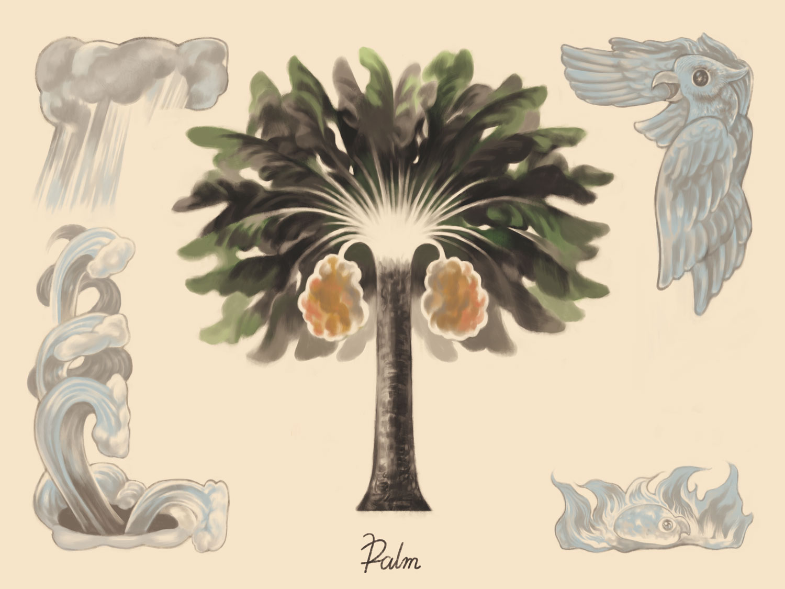

## ナツメヤシ

> My hair is Nu; my face is Ra; my eyes are Hathor; my ears are Wepwawet; my nose is She who presides over her lotus leaf; my lips are Anubis...
> 〈死者の書 Spell:42〉

- *勝利・上昇・永遠・不死*
- *フェニックス/アポロ/生命の木/殉教のナツメヤシ*

オリエントに起源を発し、古代より栽培される。古代オリエントや中東ではヤシは生命の木、その根元に湧く水は生命の泉とされ楽園と関連している。不死や再生の意味を持つフェニックスとも関連している。エジプト神話では原初の水の神や永遠の神がヤシの枝を持って描かれる。キリスト教ではナツメヤシは受難と死からの復活を表し生命の樹や泉としての役割も受け継ぐ。またマリアの死にまつわる伝説にも登場する。

果実はデーツと呼ばれていて スーパーなどで比較的安易に手に取ることができる。味は黒糖のような甘味が強いが香りに少しクセがある。

{}
{}
