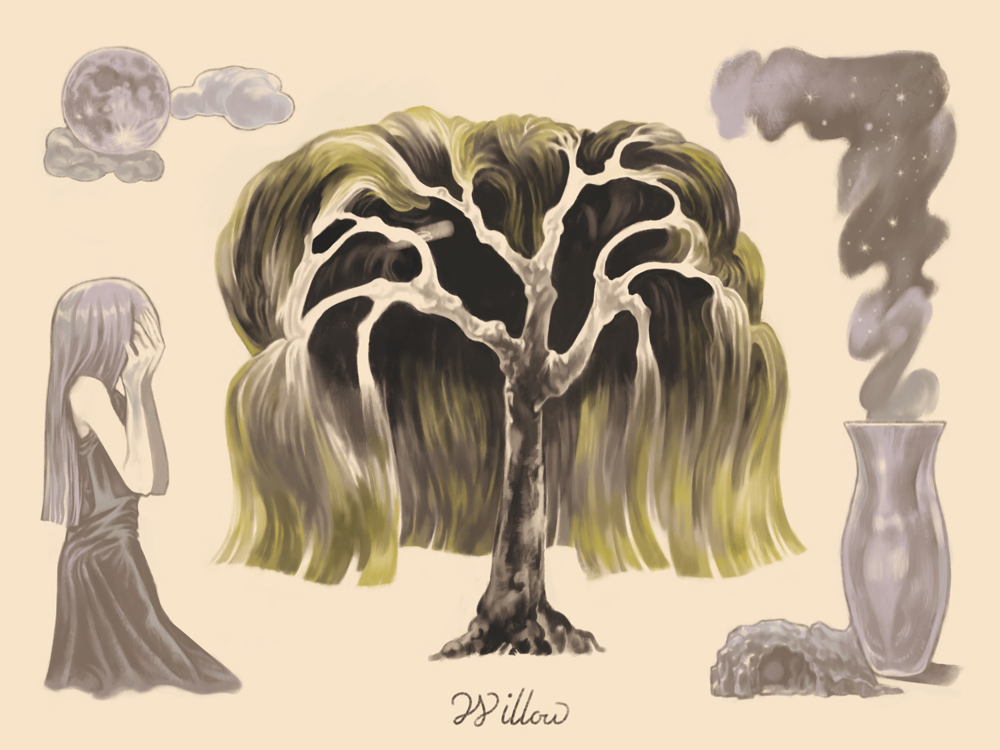

## ヤナギ

>それからというもの姉は、毎日、川の辺にきてはたたずんで、じっと水の面に映うつる自分の姿を見てはものを思い、（中略）ある日のこと、姉は日が暮れても帰らずに一ところに立ちつくしていますと、一夜の中に姉の姿は消えて、そこに一本の柳となっていたのであります。
>〈木と鳥になった姉妹 小川未明〉

- 死・冥府・貞潔
- 月・水
- ヘカテー(アスピリン)/オルフェウス/柳女/三十三間堂の棟木/アルテミス

1700年の終わりから1800年の初めにかけて、ピューリタンの墓石には壺またはランプとヤナギが彫刻された。
ハープ（ハイランドハープを含む）はしばしば柳から彫られた。
日本の民話に柳の精や妖怪があり、変身談として語られる。
ナギの杖は冥界では身体加護の役目を果たし、オルフェウスも1本携え冥界下りの際に道案内の役を果たした。

>wicca (「魔術」)という言葉はwicker (「ヤナギの小枝細工」)と同一語源の、ヤナギを意味する言葉に由来すると主張するものもいた。魔力を持つネコは、ネコヤナギ、またはヤナギの尾状花序catkinから生まれ、魔女の使い魔であるネコrnalkinとなると考えられた。このことから「ネコはすべて最初は灰色」という諺が生まれた。
>[Willow（ヤナギ） - ギリシア神話・伝説ノート](http://web.kyoto-inet.or.jp/people/tiakio/antiGM/willow.html)