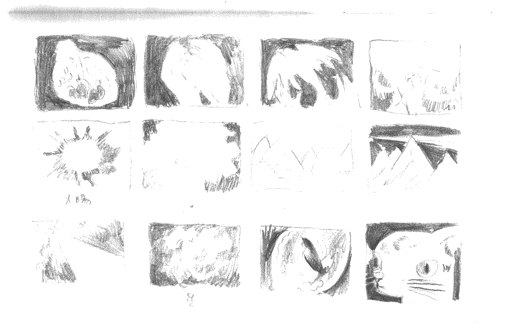



00：48 
5 frames per second

## アニメーションについて
「庇護されていた小鳥が飛び立ってゆく」「それを猫が見ている」という着想から始まり、そこに宇宙、雲、山のモチーフを組み込んだアニメーションを制作しました。技術的にはメタモルフォーゼ(変容)とエフェクトを中心に、手描きアニメーションのようなマチエールの映像をテーマにしています。

昨年の10月にエスキースを描いていたのですが私生活の慌ただしさから作業に移るタイミングを見つけられず、今年の4月下旬からアニメーションを描き始めました。イメージにある動きを確かめては描き、それをひたすら続ける作業は自身の根気が試されているようでした。描いている間に春も過ぎて初夏の日差しが注ぎ、いつの間にか空の星の位置も変化していました。そんな時間の流れがアニメーションという時間を扱う媒体と連動するように感じています。

いつも部屋に篭って制作するので、生活音を組み合わせた音を映像に添えています。音の制作は初めてで心理的に戸惑いもありましたが、音を扱うのは案外面白くて奥が深いものでした。音作りに興味が湧いたのでまた何か作ってみたいと思いました。

2025年5月

***

Starting from the idea of ​​“a protected little bird fly” and “a cat looking it”, I created an animation incorporating the motifs of space, cloud and mountain. Technically, the theme is texture like a hand-drawn animation, focusing on metamorphosis and effects.

I drew a sketch in October last year, but due to my busy personal life I couldn't find the time to move on to work, so I started drawing the animation in late April this year. Checking the movements in the image, drawing them, and continuing the work seemed to test my perseverance. While I was drawing, spring passed and the early summer sunshine poured in, and the position of the stars in the sky had changed without me noticing. I feel that such a flow of time is linked to animation, a medium that deals with time.

I always work in my room, so I add sounds to the video that are a combination of everyday life. It was my first time creating sound, and I was psychologically confused, but dealing with sound was surprisingly interesting and profound. I became interested in sound production, so I wanted to create something again.

May 2025

  

## エスキース

Title
: 　

Year
: 2025

Software
: Photoshop, GarageBand, Final Cut Pro

