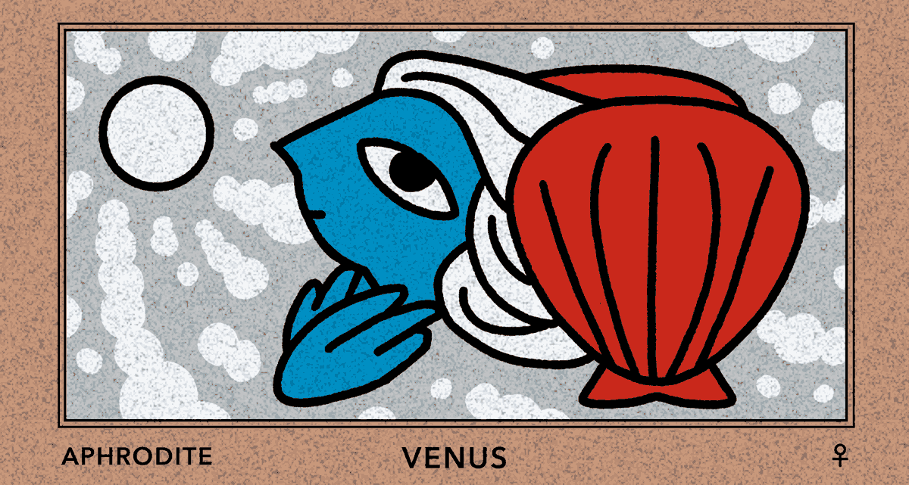

## ZODIAC
{.title}

  

## PLANETS (Astrology)
{.title}



#zodiac,#planet{
    display: flex;
    flex-wrap: wrap;
    gap: 1rem;
    justify-content: center;

    figure{
    margin: 0;
    width: 100%;
   box-shadow: 0 4px 8px -2px rgba(0, 0, 0, 0.2);
   line-height:0;

    img{
            border-radius: .3rem;
    }
}
}
#zodiac > figure{
        max-width: calc(33.333% - 1rem);
}

#planet > figure{
        max-width: calc(50% - 1rem);
}


  

Title
: 　

Year
: 2025

Software
: Photoshop
